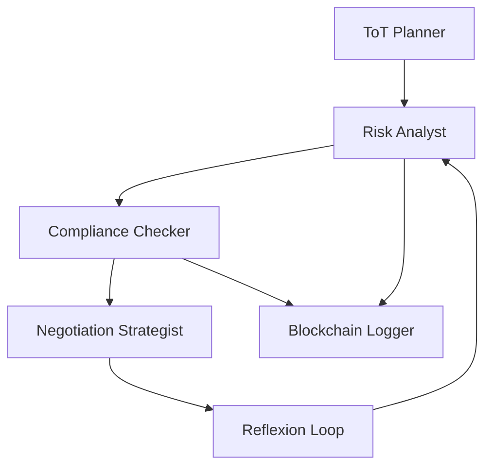

# 📄 **Jurybee: Agentic NDA Analyzer Prototype**  
**A multi-agent AI system for explainable NDA analysis using Tree-of-Thoughts (ToT), Retrieval-Augmented Generation (RAG), and blockchain-backed audit trails.**

---

## 🔍 **What is Jurybee?**  
Jurybee is an agentic AI prototype designed to simplify the complexity of Non-Disclosure Agreements (NDAs). It combines:  
- **Multi-Agent Reasoning**: Simulates a legal team (Risk Analyst, Compliance Checker, Negotiation Strategist) to debate and refine NDA clauses.  
- **Tree-of-Thoughts (ToT)**: Generates multiple interpretations of ambiguous clauses and self-reflects via Reflexion Loops.  
- **Legal-Specific RAG**: Uses Legal-BERT embeddings to retrieve relevant statutes and case law for risk scoring.  
- **Blockchain Audit Trail**: Logs every analysis step to a tamper-proof ledger (Polygon testnet).  

---

## 🎯 **Why It Matters**  
- **Problem**: Legal documents like NDAs are dense, time-consuming to review, and prone to human error.  
- **Solution**: Jurybee automates risk detection, explains decisions, and ensures auditability—all in one click.  
- **"Aha!" Moment**: Users upload two NDA drafts, and Jurybee highlights *semantic differences* (not just text) using Sentence-BERT heatmaps.  

---

## 🧠 **Architecture Overview**  


*Visualized in [jurybee_architecture.py](jurybee_architecture.py)*  

---

## 🚀 **Quick Start**  
1. **Clone the repo**:  
   ```bash
   git clone https://github.com/your-username/jurybee.git
   cd jurybee
   ```
2. **Install dependencies**:  
   ```bash
   pip install -r requirements.txt
   ```
3. **Run the architecture visualization**:  
   ```bash
   python jurybee_architecture.py
   ```
4. **Next Steps**:  
   - Implement RAG pipeline with Pinecone + Legal-BERT.  
   - Build Streamlit UI for clause comparison.  

---

## 🛠️ **Tech Stack**  
| **Component**           | **Tool**                          |  
|------------------------|-----------------------------------|  
| **LLMs**               | GPT-4 API, Legal-BERT             |  
| **Agent Frameworks**   | LangChain, LlamaIndex             |  
| **Vector DB**          | Pinecone (RAG)                    |  
| **Frontend**           | Streamlit (planned)               |  
| **Blockchain**         | Polygon SDK (testnet)             |  

---

## 📁 **Folder Structure**  
```bash
jurybee/
├── agents/               # Multi-agent roles (risk_analyst.py, etc.)
├── tools/                # RAG, ToT planner, reflexion loop
├── prompts/              # Prompt templates for agents
├── data/                 # NDA corpus, case law, logs
├── ui/                   # Streamlit frontend (planned)
└── jurybee_architecture.py # Visualizes agent workflow
```

---

## ✅ **Contributing**  
Pull requests welcome! For major changes, file an issue first.  

## 📜 **License**  
MIT License  

---

**Built for speed, modularity, and impact at a hackathon.**  
*Deployed as a prototype—production enhancements welcome!*  

---  
**Next Step**: Commit this README, then run `git add .` to stage all files before your first commit. 🚀